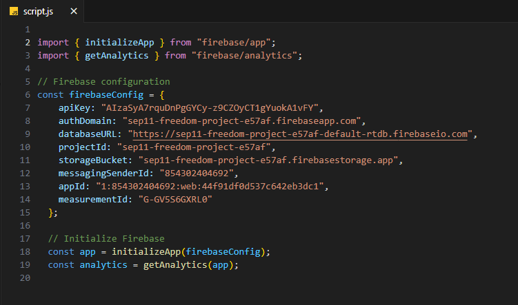

# Entry 4
##### 3/10/25

### Context
As of now I am still learning my tool I've planned out my freedom project.

---

### Learning my tool:

 continued the todo list project and created code to allow the user to add and delete documents to the Firebase database.

#### Adding

* First I created a form on html to have a place for the user to put their inputs. One text input would be for the task and the other would be for the date of the task.
```js
 <form class = "add">

        <label for = "task">Add:</label>
        <input type="text" name="title" required>
        <label for = "created">The date:</label>
        <input type="text" name="date" required>

        <button>add a task</button>
        </form>
```

* Now I need to make these inputs go somewhere. First I had to use a `querySeletor` to allow changes to be made to the form in JS.

```js
const addTask = document.querySelector(".add");
```
I stored the `querySelector` into a `const` because it's easier to just write `addTask` then to keep on writing `document.querySelector(".add");`.

* Then I used an EventListener to listen for when the form is submitted and run a function once it hears the event.

```js
addTask.addEventListener("submit", (e) => {

        addDoc(colRef, {
            task: addTask.task.value,
            created: addTask.created.value
        })
        .then(() => {
            addTask.reset()
        })
    })
```
When the user hits submit it will add the value of `addTask` into the colRef (the database) and then the form will reset.

Before:


After:


#### Deleting

* Just like for adding I created a form in HTML for deleting task. The user would have to write the ID of the task and push a button to delete it.

```js
 <form class = "delete">
    <label for="id">Document id</label>
    <input type = "text" name="id" required>
    <button> delete task </button>
  </form>
```

* Then again I used a `querySeletor` to link this form to my JS file and then an `EventListener` to run a function when the form is submitted. This function will find the id of the item in the "tasks" collection and then run a deleteDoc function which deletes the item in the firebase database.

```js
const deleteTask = document.querySelector(".delete");
  deleteTask.addEventListener("submit", (e) => {
      const docRef = doc(db, 'tasks', deleteTask.id.value)
      deleteDoc(docRef)
      .them(() => {
          deleteTask.reset()
      })
  })
```

####

---

### Engineering Design Process
Currently I am on stage 4 & 5 of the Engineering Design Process which are to plan the most promising solution and create a prototype. As of now I created a plan to help me create the prototype, or a Minimum Viable Product (MVP) for my freedom project.


#### What is my freedom project?
My freedom project is an app that will help users preserve their memories or thoughts for the future by allowing them to create entries to journal and document their memories and plans.

#### Planing my Freedom Project:
To help me stay on task and not procrassonate I created a timeline for myself to follow.

Here is my plan:


### MVP progress (creating the prototype):

#### Using Firebase
First I went onto the [Firebase website](https://firebase.google.com/) and create a new project called "SEP11 Freedom Project"


Then in this project I clicked "add app" to create my web app's Firebase configuration.


I typed `npm install firebase` into my terminal to install firebase into my IDE. Then I copied the Firebase configuration into my script.js file.



After installing Firebase I will now create my database. For my project I would like to save the entry and the date of the entry.

First I created a new Firestore database. Then I created a new collection called "entries" which holds a document called "entry" and this entry will have the written memory of the user and the date they wrote.


#### Working on HTML
For now I just created the title, and text inputs that users will write on to add their entries and dates.

```html
 <div>
    // title
    <h1> Time capsule</h1>
    // inputs
    <div id="entry-form" class="hidden">
        <input type="text" id="textInput" placeholder="Write a memory"> // entry input
        <input type="date" id="unlock-date"> // date input
        <button id="save-entry">Save Entry</button> // submit button
    </div>
    // where the list of entries will be
    <h2>Your Entries</h2>
    <div id="entries-list"></div>
</div>
```

##### What I have so far:


### Skills that I improved:

#### Time management
For my MVP I created a plan + deadlines for me to follow. This plan allows me to prioritize tasks and set specific timeslots for each activity which ensures that I can focus on what
needs to be done by a certain time. It also helps me avoid missing deadlines and overlooking important tasks.

#### Problem decomposition
I broke down my freedom project into multiple smaller tasks to make it more manageable to complete. Just like time management, having this skill will make sure I complete my tasks effciently and on time.

[Previous](entry03.md) | [Next](entry05.md)

[Home](../README.md)
