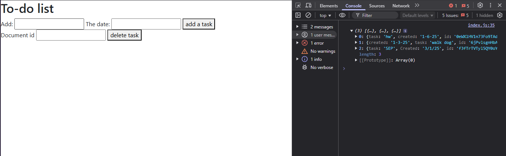

# Entry 4
##### 3/10/25

### Context
As of now I am still learning my tool I've planned out my freedom project.

---

### Learning my tool:

 continued the todo list project and created code to allow the user to add and delete documents to the Firebase database.

#### Adding

* First I created a form on html to have a place for the user to put their inputs. One text input would be for the task and the other would be for the date of the task.
```js
 <form class = "add">

        <label for = "task">Add:</label>
        <input type="text" name="title" required>
        <label for = "created">The date:</label>
        <input type="text" name="date" required>

        <button>add a task</button>
        </form>
```

* Now I need to make these inputs go somewhere. First I had to use a `querySeletor` to allow changes to be made to the form in JS.

```js
const addTask = document.querySelector(".add");
```
I stored the `querySelector` into a `const` because it's easier to just write `addTask` then to keep on writing `document.querySelector(".add");`.

* Then I used an EventListener to listen for when the form is submitted and run a function once it hears the event.

```js
addTask.addEventListener("submit", (e) => {

        addDoc(colRef, {
            task: addTask.task.value,
            created: addTask.created.value
        })
        .then(() => {
            addTask.reset()
        })
    })
```
When the user hits submit it will add the value of `addTask` into the colRef (the database) and then the form will reset.

Before:


After:



#### Deleting

* Just like for adding I created a form in HTML for deleting task. The user would have to write the ID of the task and push a button to delete it.

```js
 <form class = "delete">
    <label for="id">Document id</label>
    <input type = "text" name="id" required>
    <button> delete task </button>
  </form>
```

* Then again I used a `querySeletor` to link this form to my JS file and then an `EventListener` to run a function when the form is submitted. This function will find the id of the item in the "tasks" collection and then run a deleteDoc function which deletes the item in the firebase database.

```js
const deleteTask = document.querySelector(".delete");
  deleteTask.addEventListener("submit", (e) => {
      const docRef = doc(db, 'tasks', deleteTask.id.value)
      deleteDoc(docRef)
      .them(() => {
          deleteTask.reset()
      })
  })
```

####

---

### Engineering Design Process
Currently I am on stage 4 & 5 of the Engineering Design Process which are to plan the most promising solution and create a prototype. As of now I created a plan to help me create the prototype, or a Minimum Viable Product (MVP) for my freedom project.


#### What is my freedom project?
My freedom project is an app that will help users preserve their memories or thoughts for the future by allowing them to create entries to journal and document their memories and plans.

#### Planing my Freedom Project:
To help me stay on task and not procrassonate I created a timeline for myself to follow.

Here is my plan:


[Previous](entry03.md) | [Next](entry05.md)

[Home](../README.md)
