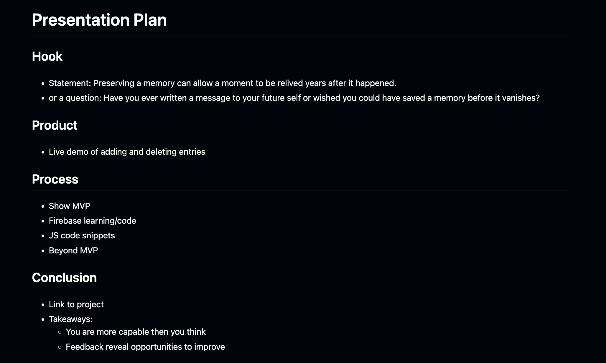

# Entry 6
##### 5/28/25

### Next Step in the Engineering Design Process
After finishing my project I will now move on to the last step of the [Engineering Design Process](https://hstatsep.github.io/students/) which is to communicate the results. To do this I will have to present my project in class and in a short elevator pitch at the SEP expo.

### In class presentation
I presented my project in class by using a slideshow. To prepare for this project I created a plan:

I used this plan to help me create the slide show. The first slide after the title slide would be the statement and a question about the importance of preserving a memory and how it can be preserved. Then I planned to do a live demo of the project to show how it works.

After that I explained the process of making my MVP. To do this I first explained my tool (Firebase) and how I used it to store the entries in my app. Then I explained the code behind features like the entry form, the list of entries, the entry counter, and the delete/add buttons.

Lastly I explained my beyond MVP features using code snippets and GIFs to show how they work. I concluded the slideshow with a slides about my takeaways from the project.

#### Post Class Presentation Takeaways
* Overall I did well in the presentation, I was able to explain my project and the code behind it clearly and because I was given a microphone I didn't have to worry much about being too quiet. One feedback I received from my teacher was that I just need to be more confident when presenting, which I will work on in the future.

Here is the slideshow I created: [Link to slideshow](https://docs.google.com/presentation/d/1t1ke4X_dKz6q6seWBYh9dFdl-pZRHLSRVD_Oe5__5dg/edit?slide=id.g359ef1a3675_0_41#slide=id.g359ef1a3675_0_41)

### SEP expo
For the SEP expo I will be presenting my project in a short elevator pitch. I also wrote down a short description of my project that I can use to explain it and I included my motavations for the project just in case I am asked why I made it.

#### Elevator Pitch:
* Explain and show how my app works:
    * If you write an entry it will update in real time and be saved.
    * All entries will be displayed on the app publicly and can be seen by anyone at any time.
    * Kind like a public blog
* Why I made this app
    * I wanted to preserve the messages of people from the past so they could be revisited by anyone in the future
    * The thing that inspired me to make the project was the feeling you get when looking at old messages or photos.

This plan is also in my [SEP11 notes](https://docs.google.com/document/d/15MZ-fNfK56i_jKZ12T9CJ7E310-NkHPu2dt72J3xSNk/edit?tab=t.0)

### Post Expo Takeaways
I think I did well showing how my website works but I had trouble with explain my motivations for the project and how I made it. I wish I had practiced my eleavtor pitch because it would have helped me be more coherent and confident when explaing the project.

### Conclusion

Overall I think I did well in the project and I am happy with how everything turned out. I learned a lot about how to use Firebase and I strengthen my ability to make a website.

### Skills

Some skills I learned from presenting my project are: **organization** and **communication**.

#### Organization
I learned how to organize my project in a way that makes it easy to understand and follow. I also learned how to create a plan for my project and stick to it.

#### Communication
In this project I got to see growth in my communication skills. At the start of the year I had trouble with eye contact and speaking clearly. But now my eye contact is much better and I can speak more coherently. I just have to work on being more confident when presenting.

#### Links:
* [SEP11 Freedom Project:](https://kosall5220.github.io/sep11-freedom-project/)
* [Code on GitHub:](https://github.com/kosall5220/sep11-freedom-project)
* [Presentation slides:](https://docs.google.com/presentation/d/1t1ke4X_dKz6q6seWBYh9dFdl-pZRHLSRVD_Oe5__5dg/edit?slide=id.g359ef1a3675_0_41#slide=id.g359ef1a3675_0_41)
* [SEP11 Freedom Project notes:](https://docs.google.com/document/d/15MZ-fNfK56i_jKZ12T9CJ7E310-NkHPu2dt72J3xSNk/edit?tab=t.0#heading=h.348zog8ysnp8)

[Previous](entry05.md) | [Next](entry07.md)

[Home](../README.md)
